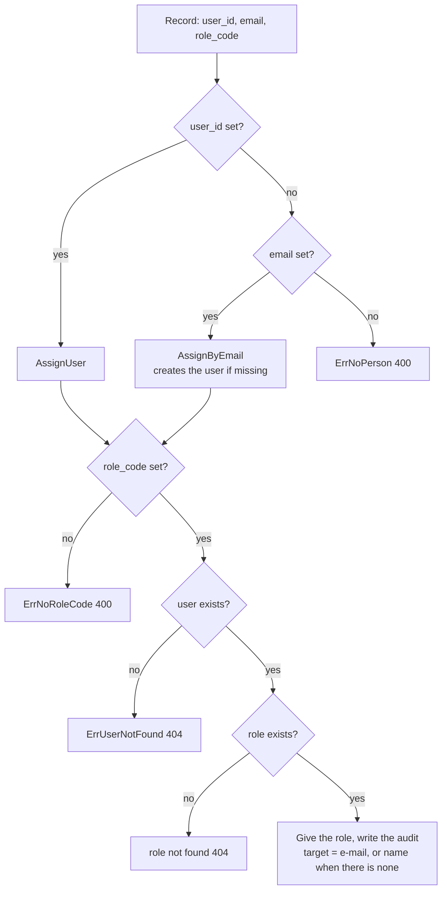

# Assign flow

What `access.assign_roles` does with each record it receives. Every branch has a test in `tests/people_test.go`.

```mermaid
flowchart TD
    A[Record: user_id, email, role_code] --> B{user_id set?}
    B -->|yes| C[AssignUser]
    B -->|no| D{email set?}
    D -->|yes| E[AssignByEmail<br/>creates the user if missing]
    D -->|no| F[ErrNoPerson 400]
    C --> G{role_code set?}
    E --> G
    G -->|no| H[ErrNoRoleCode 400]
    G -->|yes| I{user exists?}
    I -->|no| J[ErrUserNotFound 404]
    I -->|yes| K{role exists?}
    K -->|no| L[role not found 404]
    K -->|yes| M[Give the role, write the audit<br/>target = e-mail, or name when there is none]
```